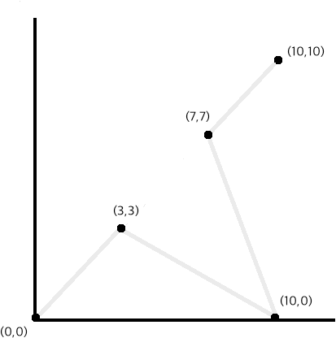

# JenniferSoft

문제 A. 알파벳 다시 배열하기

문자열 하나가 주어질 때, 알파벳의 빈도수가 적은 것들이 앞쪽에 오도록 다시 배열 하여 출력하는 코드를 작성하세요.
빈도수가 같다면 알파벳 순으로 먼저인 문자를 앞쪽에 배치하세요.

입력조건

첫 번째 라인에 입력 문자열이 주어집니다.

1 <= 문자열 길이 <= 1,000,000
문자열은 영문 대문자로만 구성됩니다.

출력

변환된 문자열을 출력합니다.

예1 - 입력)
>ABABAC

예1 - 출력)
>CBBAAA

예2 - 입력)
>DONTFORGETTHATYOUARESPECIAL

예2 - 출력)
>CDFGHILNPSUYRRAAAEEEOOOTTTT

문제 B. 영화관 자리 선택

영화관을 찾은 커플은 항상 붙은 자리를 원하기 마련입니다. 영화관의 좌석 크기와 이미 팔린 자리들의 정보가 주어질 때, 가능한 모든 좌우로 연결되어 있는 자리의 수를 출력하는 코드를 작성하세요.

입력 조건

문제를 단순화화여 영화관을 정사각형의 격자 모양이고, 각각의 격자 셀에 좌석이 하나씩 있다고 가정합니다.
입력은 첫번째 라인이 격자 한변의 길이(N)이며, 다음 N개의 라인이 좌석의 상태를 의미합니다.
각 라인은 길이 N의 문자열이며, 점(.) 문자는 팔리지 않은 자리, 별(*) 문자는 이미 판매된 자리를 의미합니다.
N의 크기는 다음과 같습니다. 1 <= N <= 1000

출력 형식

가로로 연속된 자리를 할당할 수 있는 가짓수를 출력합니다.

예1 - 입력)
>2
..
**

예1 - 출력) 첫번째 행의 두 자리가 비어있는데, 유일하게 가능한 자리이므로 답은 1 입니다.
>1000

예2 - 입력)
>4
..**
.*..
*...
....

예2 - 출력) 첫번째 행에서는 한가지, 3번째 행에서는 두가지가 가능합니다.
>7

문제 C. 휴지 줍기

정원에 있는 휴지들의 좌표들이 주어질 때, 모든 휴지들을 줍고 나갈 수 있는 최적의 경로를 구하는 코드를 작성하세요.
정원은 2차원 좌표로 각 휴지들의 좌표는 모두 정수형으로 주어집니다. 출발점은 (0,0) 이며, 도착점은 (10,10) 입니다.
최적의 경로는 이동한 거리의 합이 가장 짧은 경로입니다. 최적인 경로가 여러가지일 경우, 아무 경로나 출력합니다.

입력 조건

첫 번째 라인에 휴지의 개수 N 이 주어집니다.
두 번째 라인부터 N 개의 라인은 각각이 휴지 하나의 좌표입니다. 좌표 X 와 좌표 Y 는 공백으로 구분됩니다.
크기 제한은 다음과 같습니다. 중복된 좌표는 없습니다.
1 <= N <= 10, 정수
0 <= X, Y <= 10, 정수

출력 형식
"(X,Y)" 형식으로 경로의 좌표돌을 모두 출력합니다. 거리를 출력할 필요는 없습니다.
좌표 사이틑 " -> " 로 연결합니다.

예 - 입력)
>3
3 3
7 7
10 0

예 - 출력) 아래 그래프를 참고하세요. 거리는 sqrt(18) + sqrt(58) + sqrt(58) + sqrt(18) = 약 23.7168 입니다.
>(0,0) -> (3,3) -> (10,0) -> (7,7) -> (10,10)

문제 D. 진흙탕 탈출하기

정사각형 모양의 진흙탕을 탈출하려고 합니다. 몸을 가장 덜 더럽히고 탈출하는 코드를 작성하세요.
진흙탕은 NxN 크기로 1x1 정사각형 모양의 격자로 이루어져 있습니다. 시작 위치는 왼쪽 아래 모서리의 격자이며, 탈출구는 오른쪽 위 모서리의 격자입니다. 이동은 4방향의 인접한 격자로만 이동할 수 있습니다. 지도에는 각 위치에 있는 진흙의 양이 주어집니다.
몸의 더러운 정도는 정수형 숫자로, 지나가는 진흙의 양만큼 더러워집니다. 예를 들어, 2, 4, 5 인 진흙을 아무리 밟아도 100을 초과하지 않습니다. 예를 들어 더러움이 98인 상태에서 8을 밟더라도 더러움은 100이 됩니다.

입력 조건

첫 번째 라인에 격자의 크기 N 이 주어집니다. (1 <= N <= 10)
두 번째 라인부터 N 개의 라인에 진흙탕 지도가 주어집니다. 각 진흙 양은 0 또는 1자리 양의 정수로 주어집니다.
단, 시작 위치와 탈출구는 진흙이 없ㅅ브니다. 즉, 0으로만 주어집니다.

출력 형식

최소한으로 몸을 더럽히고 탈출 했을 때 더러운 정도를 출력하세요.
예1 - 입력)
>5
10000
09999
02010
99990
01010

예1 - 출력) S 자 모양으로 탈출하는 것이 최적입니다.
>6

예2 - 입력)
>5
22220
29999
22220
99990
01010

예2 - 출력) 예1 과 유사하지만 마지막에 9를 밟고 가는 것이 더 좋습니다.
>11

예3 - 입력)
>8
99999990
99999999
99999999
99999999
99999999
99999999
99999999
09999999

예3 - 출력) 100 미만으로 탈출하기는 불가능합니다.
>100

문제 E. JENNIFERSOFT 만들기

문자열 하나가 주어졌을 때 "JENNIFERSOFT" 문자열로 바꾸기 위한 최소 '조작'횟수를 구하는 코드를 작성해주세요.
여기서 '조작'은 다음 3가지로 정의합니다.
1. 새 문자 하나를 삽입하기
2. 문자 하나를 삭제하기
3. 문자 하나를 새 문자로 바꾸기

예를 들어 입력이 MICROSOFT 일 때 문자 5개(MICRO)를 지우고 문자8개(JENNIFER)를 추가하면 총 13번의 '조작'으로 변환이 가능합니다. 하지만 다음과 같이 수행하면 7번의 '조작'으로 변환이 가능합니다.
MICROSOFT -> (M을 J로, C를 F로 바꿈) -> JIFROSOFT -> (O를 삭제) -> JIFRSOFT -> (E,N,N,E를 삽입) -> JENNIFERSOFT

입력 조건

문자열 하나가 입력입니다. 문자열은 영문 대문자로만 구성되어 있으며, 최대 길이는 1000입니다.

출력 형식

최소 조작 횟수를 출력합니다.

예1 - 입력)
>MICROSOFT

예1 - 출력)
>7

예2 - 입력)
>JENNIFER

예2 - 출력) - 마지막에 "SOFT" 를 추가합니다.
>4
